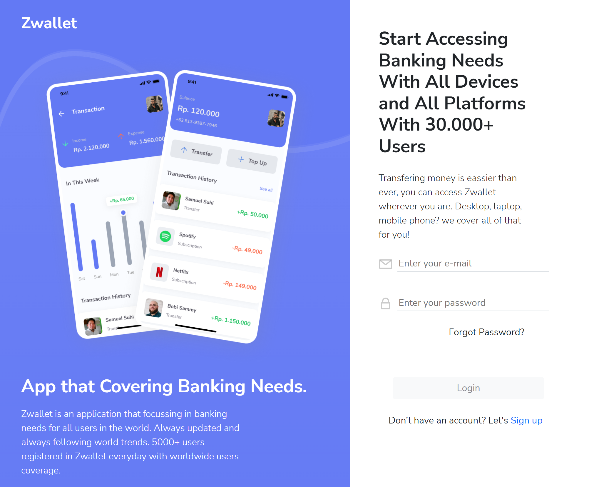
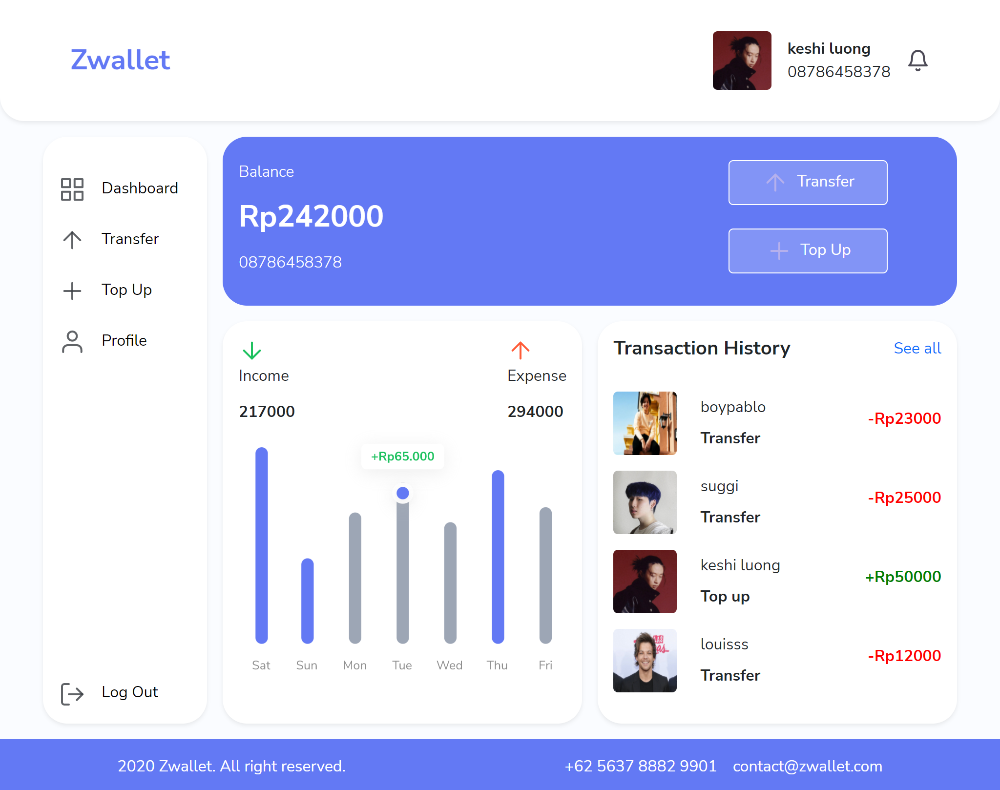

# Zwallet

Zwallet is an online service that allows one party to make electronic transactions with another party bartering digital currency units for goods and services.

## Getting Started

In the project directory, you can run:

### `npm start`

Runs the app in the development mode.\
Open [http://localhost:3000](http://localhost:3000) to view it in your browser.

The page will reload when you make changes.\
You may also see any lint errors in the console.

## Demonstration

[Zwallet App](https://zwallet-pilar.netlify.app/)

## Contents

1. Log In
2. Sign Up
3. Home Page
4. Transaction History Page
5. Transfer Flow Pages(Input, Confirmation, Success/Failed)
6. Profile

## Built With

### Bootstrap

In this repository, I used bootstrap framework to make the slicing contents based on figma and made it as similar as possible. For the responsive mobile, I used medium devices for media query range from bootstrap with min-width: 768px for tablet and desktop layout.

### React JS
### Express JS

Check out the backend repository for this project using Express JS [API](https://github.com/pilarhh/backend-zwallet.git)

## Snippets

### Desktop Layout:

### Mobile Layout:
.png)
